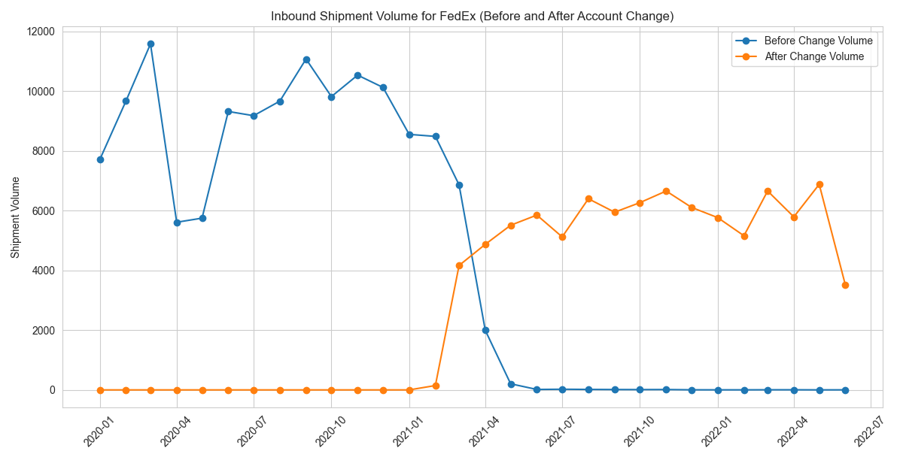

# ACME Health Shipping Volume Analysis

This repository contains an analysis of ACME Health's shipping volume from Q1 2021 to Q2 2022. The analysis focuses on understanding the patterns and changes in shipping volume, identifying potential causes, and providing insights for decision-making.

## Patterns in ACME HEALTH's Shipping Volume

- **2021 Q1**: High volume of shipments (26,044), predominantly under FedEx account 2002.
- **Post-2021 Q1**: A significant drop in volume, with only 1,787 shipments in 2021 Q2.
- **2022 Q1**: Partial recovery in volume (16,245 shipments), mainly under FedEx account 1562.
- **2022 Q2**: Another decrease in volume to 1,505 shipments.

## Potential Causes for Change in Carrier Volume

- The shift from FedEx account 2002 to 1562 in Q1 2021 coincides with the volume change, suggesting it as a potential cause.
- The drastic reduction in volume for account 2002 and the subsequent increase for account 1562 points to a possible operational or policy change related to these accounts.

## Material Volume Changes in Suppliers/Shippers

- Significant fluctuations in shipping volumes from suppliers like 'BD', 'STRYKER CDC CMF', and 'TRI-ANIM HEALTH SERVICES'.
- 'BD' and 'STRYKER CDC CMF' alternated as top shippers in different quarters, indicating changes in procurement or supplier relationships.

## Changes in Inbound Volume to Receiving Locations

- The receiving locations with the most significant changes include 'ACME HEALTH CARE', 'ST MARYS HOSPITAL', and 'ST ANTHONY HOSPITAL'.
- These locations showed substantial variances in the number of shipments received across the quarters.

## Insights on Driving Factors

- The account change is a primary suspect for the altered shipping patterns.
- Supplier relationship dynamics and changes in procurement strategies could also be influencing the shipment volumes.
- Specific recipient locations may have evolving needs or operational changes impacting shipping volumes.

## Recommendations and Further Insights

- Investigate any specific issues or changes associated with FedEx accounts 2002 and 1562.
- Review and understand changes in relationships with key suppliers.
- Assess the needs and patterns at major recipient locations to align shipping strategies.
- Further data analysis could be conducted to explore other possible factors influencing these trends.

---

This analysis provides a comprehensive overview of ACME Health's shipping volume changes and serves as a basis for further investigation and strategic decision-making.

## Graphical Analysis Summaries

### Top 10 Supplier Volume Changes for ACME HEALTH (Q1 2021 vs. Q1 2022)
.png)
This bar chart illustrates the change in shipment volumes for the top 10 suppliers to ACME HEALTH comparing Q1 of 2021 with Q1 of 2022. Each bar represents a supplier and is identified by the supplier's ID. The length of the bar shows the magnitude of increase or decrease in the number of shipments.

### Inbound Shipment Volume for FedEx (Before and After Account Change)

The line graph displays the inbound shipment volumes for FedEx before and after the account change. The blue line indicates the volume associated with the previous account number (2002), and the orange line represents the volume for the new account number (1562). It clearly demonstrates the substantial decrease in shipments associated with account 2002 following the change and the corresponding increase in shipments with account 1562.
